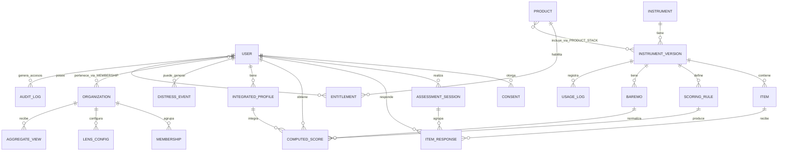

# MODELO_DATOS_CONCEPTUAL — DescubreMe (v2.0)

**Producto:** DescubreMe.
**Autor (Cowork):** [Rol: Arquitecto de sistema / Data scientist]
**Version:** 2.0
**Fecha:** 2026-06-05
**Naturaleza:** modelo entidad-relacion **conceptual**. No es schema de produccion ni DDL. Es la semilla que Claude Code aterriza en Next.js + Supabase durante la fase 1 (greenfield).
**Fuente de verdad de producto:** `PRD_MAESTRO.md` v2.0 (principios §6 instrumento-plugin, §7 reutilizacion de respuestas, §8 compliance-by-design).

`Alcance:` Cowork define entidades, relaciones y reglas a nivel conceptual. Claude Code decide tipos, indices, RLS, particiones y donde vive cada cosa (DB vs TS). Las "notas de implementacion" recogen decisiones probadas del build v1.5 como recomendacion, no como obligacion.

---

## 0. Principios que el modelo debe encarnar

| Principio (PRD) | Consecuencia en el modelo |
|---|---|
| Instrumento como plugin/metadata | Los instrumentos, versiones, items, scoring y baremos son **datos versionados**, no codigo. Anadir o intercambiar (plan-B) es alta de datos. |
| Reutilizacion de respuestas, no de tests | Una respuesta a un item se guarda **una vez** y se proyecta a los productos que la usan. |
| Compliance por diseno | `sensitivity` y `ethical_flags` viven en el modelo; NFR-27/28 se disparan por dato, no por logica de app. |
| Auditabilidad de licencias | Cada administracion de instrumento queda en `usage_log` para reportar a titulares. |
| No seleccion B2B | El empleador solo accede a agregados (n>=5). No existe ruta de dato individual -> empleador. |

---

## 1. Diagrama conceptual (ER)

---

## 2. Entidades (conceptual)

### 2.1 Catalogo de instrumentos (metadata / plugin)

| Entidad | Que es | Atributos conceptuales clave |
|---|---|---|
| `INSTRUMENT` | Test psicometrico | codigo, nombre, constructo, `sensitivity`, `ethical_flags` |
| `INSTRUMENT_VERSION` | Version concreta de un instrumento | instrument, version, idioma, `item_count`, escala (likert_min/max o tipo), estado de licencia (preliminar), plan-B referenciado |
| `ITEM` | Item de una version | version, texto (stem), `sequence_number`, escala/anclas (ref.), reverse_key, dimension/faceta destino |
| `SCORING_RULE` | Regla de calculo de una escala/subescala | version, dimension, formula (suma/promedio/clave), reverse keys, reglas de agregacion |
| `BAREMO` | Norma de referencia | version, poblacion (CO/MX/INTL), tipo (percentil/T/ECDF), datos de referencia |

`Nota de implementacion (v1.5 probado):` las **anclas de respuesta** se mantienen en codigo/config (TS: `lib/questionnaire/response-scales.ts`), no como filas de DB; los **helpers de scoring** en TS (`lib/scoring/*.ts`). El motor lee `likert_min/max` de `INSTRUMENT_VERSION` y opera sobre `raw_value` numerico. La metadata del instrumento (codigo, version, items, ethical_flags) si vive en DB para que el swap a plan-B sea alta de datos.

### 2.2 Datos del usuario y respuestas

| Entidad | Que es | Atributos clave |
|---|---|---|
| `USER` | Persona (B2C) o empleado (B2B) | id, auth (magic link), idioma, geo (para precio/baremo) |
| `ASSESSMENT_SESSION` | Una sesion de respuesta (permite pausar/reanudar) | user, instrument_version, estado, progreso, timestamps |
| `ITEM_RESPONSE` | Respuesta a un item | user, item, `raw_value`, timestamp, session. **Unica por user+item** (reutilizable entre productos) |
| `COMPUTED_SCORE` | Puntaje calculado de una escala | user, scoring_rule, valor crudo, valor normalizado (via baremo), version de calculo, trazabilidad |
| `INTEGRATED_PROFILE` | Salida del Motor de Perfil Integrador | user, conjunto de computed_scores integrados, salidas (ajuste, tensiones, fortalezas-en-accion, drivers, constelacion), flags de cruces exploratorios |

`Regla (reutilizacion):` `ITEM_RESPONSE` es unica por `user + item`. Si dos productos usan el mismo item, la respuesta se guarda una vez y ambos `COMPUTED_SCORE` la proyectan. Esto materializa el principio 7 del PRD (cero re-toma).

`Regla (trazabilidad de scoring):` cada `COMPUTED_SCORE` referencia la `SCORING_RULE` y el `BAREMO` con que se calculo, mas una version de calculo, para reproducibilidad (Gate 1).

### 2.3 Productos y acceso

| Entidad | Que es | Atributos clave |
|---|---|---|
| `PRODUCT` | Free / Paid / B2B-A / Ikigai | codigo, descripcion |
| `PRODUCT_STACK` | Que versiones de instrumento incluye un producto | product, instrument_version, modulo/capa de reporte, orden |
| `ENTITLEMENT` | Derecho de un user a un producto | user, product, estado (activo/expirado), origen (compra/beneficio B2B) |

### 2.4 Multi-tenant B2B

| Entidad | Que es | Atributos clave |
|---|---|---|
| `ORGANIZATION` | Empresa cliente B2B | id, nombre, plan |
| `MEMBERSHIP` | Relacion empleado-empresa | user, organization, equipo/area, rol (empleado/admin) |
| `LENS_CONFIG` | Lentes activas de la empresa | organization, lentes seleccionadas (PRD §7) -> instrumentos derivados |
| `AGGREGATE_VIEW` | Vista agregada anonima | organization, lente, metrica, periodo, **n (>=5)**, valor agregado |

`Regla (no seleccion, n>=5):` `AGGREGATE_VIEW` solo existe cuando n>=5 por celda. No hay relacion que conecte un `COMPUTED_SCORE` individual con el rol admin de una `ORGANIZATION`. El empleado ve su perfil; la empresa ve solo `AGGREGATE_VIEW`. Esta separacion es estructural (modelo), no de permisos de aplicacion.

### 2.5 Compliance y seguridad

| Entidad | Que es | Atributos clave |
|---|---|---|
| `CONSENT` | Consentimiento versionado, por producto | user, product, version de consentimiento, otorgado/revocado, timestamp |
| `USAGE_LOG` | Administracion de instrumento (auditoria de licencia) | user, instrument_version, timestamp (para reporte a titular) |
| `AUDIT_LOG` | Accesos a datos sensibles | actor, entidad (`item_response`/`computed_score`), accion, timestamp (inmutable) |
| `DISTRESS_EVENT` | Senal de malestar detectada | user, instrument, umbral disparado, accion (NFR-28), timestamp |

`Regla (compliance-by-design):` `INSTRUMENT.ethical_flags = emotional_distress` activa, en runtime, el disclaimer NFR-27 (pre/post) y la evaluacion de umbrales que puede generar un `DISTRESS_EVENT` y la ruta NFR-28. El `CONSENT` es granular por `PRODUCT` y revocable (<=2 clicks). El `AUDIT_LOG` de accesos a `ITEM_RESPONSE` y `COMPUTED_SCORE` es inmutable.

---

## 3. Reglas transversales (invariantes del modelo)

1. **Una respuesta, un registro:** `ITEM_RESPONSE` unica por `user+item`; se proyecta a todos los productos que la usan.
2. **Scoring reproducible:** todo `COMPUTED_SCORE` guarda regla + baremo + version de calculo.
3. **Instrumento intercambiable:** un swap a plan-B es alta de `INSTRUMENT_VERSION` + `SCORING_RULE` + `BAREMO`; el motor no cambia (principio 1).
4. **Sensibilidad declarada en dato:** `sensitivity` / `ethical_flags` en el catalogo; NFR-27/28 se disparan por dato.
5. **Aislamiento B2B:** ningun camino del modelo lleva de un dato individual al rol admin de una organizacion; solo `AGGREGATE_VIEW` (n>=5).
6. **Consentimiento como precondicion:** sin `CONSENT` activo del `PRODUCT`, no se crean `ITEM_RESPONSE` de ese producto.
7. **Cifrado y auditoria:** datos sensibles cifrados en reposo (AES-256) y transito (TLS 1.3+); accesos auditados (Gate 2). (Decision de implementacion; el modelo solo lo exige.)

---

## 4. Cómo el integrador usa el modelo (conceptual)

El `INTEGRATED_PROFILE` no recolecta datos nuevos: lee `COMPUTED_SCORE` de varios instrumentos del usuario y produce las seis salidas del PRD §6 (ajuste persona-trabajo, coherencia/tensiones, fortalezas-en-accion, drivers de bienestar, bordes de crecimiento, constelacion). Cada salida referencia los `COMPUTED_SCORE` de origen (trazabilidad) y marca si el cruce es respaldado por evidencia o **exploratorio** (se redacta como hipotesis, no como hecho). El Free genera una version reducida (teaser) sobre 4 instrumentos; el Paid la version completa.

`Limite:` los cruces son combinaciones de puntajes, no constructos nuevos. El modelo no debe permitir que una salida exploratoria se presente como medida validada.

---

## 5. Gaps y decisiones diferidas a Claude Code (fase 1)

| Tema | Quien decide | Nota |
|---|---|---|
| Tipos, indices, RLS, particiones | Claude Code | Esta spec es conceptual |
| Anclas en TS vs DB | Claude Code (recom. TS, probado v1.5) | Memoria de proyecto: anclas en `lib/questionnaire/response-scales.ts` |
| Materializar vs calcular `COMPUTED_SCORE` | Claude Code | Decision tecnica (cache vs on-the-fly); ver DD historico de v1.5 |
| Estructura de `INTEGRATED_PROFILE` (persistida vs derivada) | Claude Code | Conceptualmente es derivada de `COMPUTED_SCORE` |
| Modelo de baremo ECDF Colombia (RIASEC) | Cowork + Claude Code | Memoria: DD-57 v3.0 conversion por producto |

---

## 6. Changelog

| Version | Fecha | Cambios |
|---|---|---|
| 2.0 | 2026-06-05 | Modelo conceptual inicial v2.0 (greenfield). Instrumento-plugin, reutilizacion de respuestas, integrador como derivado, multi-tenant B2B con aislamiento estructural (n>=5), compliance-by-design. Notas de implementacion probadas de v1.5 como recomendacion. |

---

*Fin de MODELO_DATOS_CONCEPTUAL v2.0. Conceptual, sin DDL. Claude Code lo implementa en fase 1. En conflicto sobre producto, prevalece `PRD_MAESTRO.md`; sobre implementacion, decide Claude Code.*
